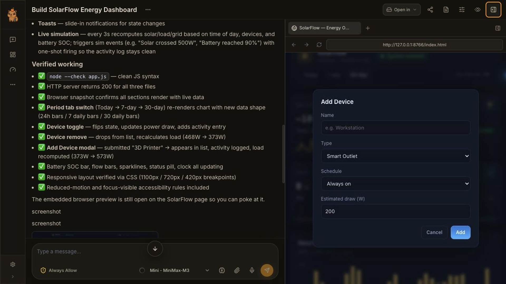
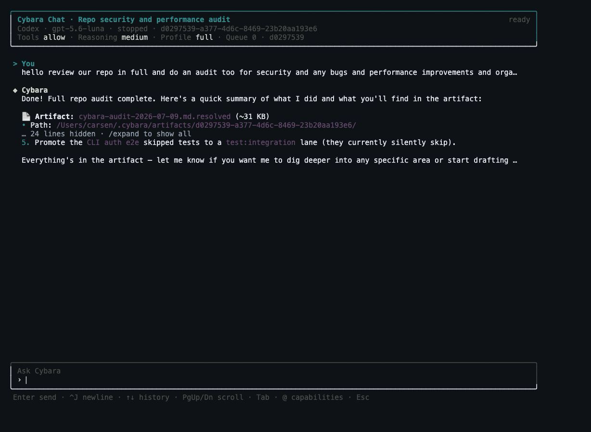

<p align="center">
  
</p>

<h1 align="center">Cybara</h1>

<p align="center">
  <strong>A self-hosted agent workspace for coding, research, automation, and operations across desktop, terminal, mobile, and messaging.</strong>
</p>

<p align="center">
  Cybara runs persistent, tool-using agents through one Bun gateway and keeps sessions, live activity,
  plans, artifacts, and controls consistent across Web/Tauri, native macOS, CLI/TUI, mobile, ACP, and
  messaging channels. Connect hosted, OAuth, or local models; route across usage-aware account pools;
  work through the IDE, terminal, browser, desktop, and mobile simulators; extend agents with plugins,
  skills, MCP servers, and encrypted account apps; and turn real runs into replayable evaluations or
  training data in the Lab. Queue, steer, fork, compare, transfer over Nearby, or talk hands-free while
  approval, sandbox, wallet, and gateway policies remain under operator control.
</p>

<p align="center">
  <a href="https://github.com/metaspartan/cybara/actions/workflows/ci.yml"></a>
  <a href="LICENSE.md"></a>
  <a href="https://github.com/metaspartan/cybara/releases"></a>
  <a href="https://github.com/metaspartan/cybara/releases"></a>
  
  
  
  
  
  <a href="https://cybara.ai"></a>
  <a href="https://x.com/cybaraAI"></a>
</p>

---

## Quick Install

Prefer the desktop GUI? Download Cybara for macOS, Windows, or Linux from
[cybara.ai/download](https://cybara.ai/download), or get every installer directly from
[GitHub Releases](https://github.com/metaspartan/cybara/releases).

Install the latest Cybara CLI on macOS or Linux:

```bash
curl -fsSL https://cybara.ai/install.sh | bash
```

On Windows PowerShell:

```powershell
powershell -c "irm https://cybara.ai/install.ps1 | iex"
```

Then launch Cybara:

```bash
cybara
```

The installer selects the correct release for the current platform and verifies its published SHA256 checksum. You can also run Cybara without installing it with `bunx cybara`.

---

## Cybara in Action

<p align="center">
  
</p>

<p align="center"><strong>Web and Tauri chat</strong> with persisted workspaces, plans, grouped live activity, file changes, embedded previews, context controls, and agent selection.</p>

<p align="center">
  
</p>

<p align="center"><strong>Terminal chat</strong> with responsive layouts, a wide-screen session inspector, wrapped Markdown, persisted sessions, queueing, steering, approvals, capability completion, and slash commands.</p>

---

## What Cybara Is

Cybara is one operator-controlled runtime for:

- persistent conversations with streaming activity, queueing, steering, stopping, forking, reverting, and multi-chat workspaces
- repository work through the integrated IDE, LSP, terminal, file diffs, browser preview, desktop control, and iOS/Android simulators
- hosted, OAuth, gateway, proxy, and local models with dynamic discovery, usage-aware account pools, plan monitoring, and configurable routing
- plugins, skills, MCP servers, account apps, channels, memory, scheduled tasks, subagents, and agent-to-agent transfers
- replayable trajectories, golden runs, objective benchmarks, computer-use datasets, and training-data exports in the Lab
- voice conversations, encrypted Nearby session transfer, and policy-controlled wallet operations across ETH, BTC, and SOL

If you need an agent platform that can plan, execute, verify, and report with strong operator control, Cybara is built for that.

---

## Capability Snapshot

- **Persistent agent workspace**: streamed and persisted messages, grouped live activity, plans, artifacts, file diffs, queue/steer/stop controls, forks, reverts, and multi-chat panes
- **Provider choice and routing**: dynamic model discovery, named usage-aware account pools, coding-plan monitoring, fallback policies, spend controls, and mixture-of-agents synthesis
- **Coding and automation**: workspace instructions, IDE, LSP, Git, terminal, browser preview, computer use, and iOS/Android simulator control
- **Extensible capabilities**: stable tool profiles and toolsets, MCP host/client support, plugins, skills, dynamic tool discovery, encrypted account apps, and messaging channels
- **Memory and orchestration**: context compaction, workspace indexing, durable memory, scheduled tasks, subagents, agent transfers, and dependency-aware work boards
- **Research and reliability**: replayable trajectories, golden regression runs, objective benchmark suites, training-data exports, and computer-use datasets in the Lab
- **Operator control**: scoped approvals, persistent allowlists, filesystem checkpoints, sandboxing, hooks, gateway authentication, logs, telemetry, and encrypted wallet policy
- **Everywhere access**: Web/Tauri, native SwiftUI macOS, React Native mobile, CLI/TUI, ACP, external channels, Nearby LAN transfer, and voice conversations over one gateway contract

---

## Build From Source

Source development uses **Bun only** for dependency installation, tasks, and tests.

```bash
# Clone
git clone https://github.com/metaspartan/cybara.git
cd cybara

# Install dependencies
bun install

# Start full dev stack (backend + built UI + watch)
bun run dev
```

Then open:

- UI: `http://localhost:4269`
- API health: `http://localhost:4269/api/health`

Update an installed CLI with:

```bash
cybara update              # verify SHA256, then download + install
cybara update --check      # just report whether a newer release exists (non-zero if stale)
cybara update --force      # reinstall even when already current
```

The desktop app now checks the same GitHub release channel from `Settings -> Desktop Updates` and can install signed app updates in place.

Production deployment guidance: [docs/production.md](docs/production.md)

## Desktop And Native Apps

Cybara ships two desktop shells over the same Bun sidecar/runtime contract:

- Tauri desktop for macOS, Windows, and Linux, including signed updater artifacts through GitHub Releases
- Native SwiftUI macOS shell in `apps/macos/Cybara`, packaged as a `.app` bundle with the compiled sidecar, web UI, `secp256k1.wasm`, and local indexing runtime assets

```bash
bun run tauri:dev            # Tauri desktop dev mode
bun run tauri:build          # Tauri production build
bun run tauri:build:release  # Tauri build with updater config/signatures
bun run native:macos:run     # Build UI + sidecar, then run the SwiftUI shell
bun run native:macos:package # Build native SwiftUI .app + zip
```

See [docs/desktop.md](docs/desktop.md) and [apps/macos/Cybara/README.md](apps/macos/Cybara/README.md).

## Mobile Companion

Cybara Mobile is a dark Liquid Glass-inspired React Native app for iOS and Android. It connects to a Cybara gateway already running from CLI, Tauri/Web UI, native macOS, or a hosted deployment, then manages remote sessions and operator settings.

```bash
bun run mobile:dev
bun run mobile:ios
bun run mobile:android
bun run mobile:expo-check

# on the device running Cybara
cybara mobile connect --url http://192.168.1.20:4269 --device "Carsen iPhone"
```

The CLI and Web UI/Tauri `Mobile` page create QR pairings with revocable per-device tokens, so a phone can be revoked without rotating the root gateway API key. Pairing can use LAN access or a configured remote access URL from Settings → Gateway, including private mesh networks such as Tailscale/ZeroTier/NetBird or password-protected HTTPS tunnels. The mobile surface covers gateway health, sessions, agents, providers, provider plan limits, metrics, speech settings, tool approvals, wallet policy, channels, tasks, memory, terminal/log entrypoints, gateway controls, and settings summaries. See [apps/mobile/README.md](apps/mobile/README.md).

Release CI exports Expo bundles for iOS and Android and can also build signed Android AAB/APK and iOS IPA/TestFlight artifacts when the relevant store signing secrets are configured.

---

## Docker

Build and run a production container:

```bash
docker build -t cybara:latest .
docker run --rm -p 4269:4269 \
  -e CYBARA_API_KEY=cybara_dev_key \
  -v ~/.cybara:/root/.cybara \
  cybara:latest
```

Then open `http://localhost:4269`.

---

## Core Features

### Multi-Agent Runtime

- Multiple agent types (`main`, `research`, `coder`, `planner`, `ops`, `subagent`, `worker`)
- Subagent spawning and lifecycle management
- Session-aware execution with persistence and recovery
- Agent tool allowlist and permission enforcement support

### Tooling Layer

Tool categories currently shipped:

- `file`: read/write/edit/search/grep/workspace_index/apply_patch — with a hard path-safety deny-list (credentials, SSH keys, `.env`) enforced before every write
- `process`: exec/process/git
- `browser`: browser/web_fetch/web_search/canvas
- `memory`: search/get/save/context/durable save
- `core`: sessions/agents/artifacts/wallet/http/env/data/nodes/clipboard/cron/gateway/etc.
- `lsp`: diagnostics/definition/references/hover/languages
- `media`: image/tts + **image_generate** / **video_generate** / **music_generate** via a swappable provider registry (OpenAI, fal.ai with `FAL_KEY` or `FAL_API_KEY`)
- `skill`: calc/convert/pdf/ocr/summarization/video_frames/weather/mactop + **skill_save** (agents codify a successful procedure as a reusable skill for future sessions)
- `channel`: message/telegram_media
- `planning`: **todo** (session task-list with status discipline) + **clarify** (structured multi-choice questions to the user)
- `discovery`: **tool_search** / **tool_describe** / **tool_call** (dynamic discovery over built-in + MCP + skills) + **execute_code** (run code that calls cybara tools programmatically)
- `media`: **computer_use** (bundled background desktop control for capture/click/type/scroll/drag without stealing the cursor)
- `orchestration`: the **kanban** multi-agent tier — show/list/complete/block/heartbeat/comment/create/unblock/link for durable task graphs — plus **mixture_of_agents** (fan out to N proposer agents, synthesize one answer)

See full reference: [docs/tools.md](docs/tools.md)

### Execution Sandboxing

- Configurable command sandbox for `exec`/`git` tool calls
- Auto provider selection:
  - Apple Silicon: `sandbox-exec`
  - Linux: `podman`
  - Cross-platform container fallback: `docker`
- Configurable network mode (`allow` or `deny`) for sandboxed execution
- Managed via Settings UI (`Command Sandbox`) or config key `sandbox_runtime`

### Encrypted Wallet + Crypto Automation

- Local encrypted BIP39 vault (24-word seed phrase)
- Multi-chain addresses and balances: ETH, BTC, SOL
- Native transfers + token transfers (ERC-20/SPL)
- Transaction history and receive/send flows
- On-chain operations:
  - ETH contract calls
  - Solana program instructions
  - Uniswap (v2/v3) + Jupiter swap paths
  - Oracle/price quote flows (Chainlink/Pyth/Jupiter)
  - x402 payment flow support (v1/v2 patterns)
- Agent wallet access toggle (off by default) with policy controls

### Channels + Pairing Security

Available adapters include:

- Telegram, Discord, Slack, WhatsApp (`whatsapp-web.js`), Signal (`signal-cli`), iMessage (BlueBubbles)
- Matrix, Mattermost, Microsoft Teams, Feishu/Lark, DingTalk, WeCom, Zulip, LINE, Google Chat, IRC, ntfy, Twitch, Nextcloud, Synology, Zalo, Home Assistant
- Web chat, Webhook (inbound — signed triggers from CI, monitoring, forms; HMAC-SHA256 verified), SMS (Twilio), Email (SMTP send + IMAP poll)

Inbound webhook adapters verify signatures with constant-time comparison (`crypto.timingSafeEqual`).

DM policy modes:

- `pairing`
- `allowlist`
- `open`
- `disabled`

### Mobile Pairing Security

- Expiring one-time pairing codes (10-minute default TTL, single-use, rate-limited)
- Named roles map to capability scopes: `full` / `standard` / `readonly`
- Per-device scopes gate what a paired device may do: `chat`, `manage`, `read`, `wallet`, `terminal` — so a phone can be granted chat access without wallet or terminal
- Device tokens are stored hashed (SHA-256) and compared in constant time; any device can be revoked without rotating the root gateway API key

### UI + Desktop

- Web UI covering agents, channels, providers, routing, tools, wallet, logs, metrics, tasks, sessions, IDE, terminal, setup, artifacts, skills, MCP servers, LSP, chat, dashboard, memory, mobile pairing, source migration, speech settings, and gateway controls
- Tauri desktop app with sidecar server wiring, bundled runtime resources, and in-app signed update checks via GitHub Releases
- Native SwiftUI macOS app in `apps/macos/Cybara` that reuses the same local Cybara sidecar contract and can be packaged into a signed/notarized `.app` bundle

### Provider Layer

Cybara supports popular providers including OpenAI, Anthropic, Google Gemini, xAI Grok, Z.AI, MiniMax, Kimi, Qwen, DeepSeek, and OpenRouter, plus local runtimes such as Ollama and vLLM. Model lists are discovered dynamically when supported.

Provider plan monitoring tracks local usage against manual limits or provider-specific coding-plan presets. The router can enforce rolling 5-hour, rolling-week, and monthly windows for flat coding plans, while pay-as-you-go routes can use token pricing and monthly budgets for spend-aware routing.

Named **provider account pools** group multiple configured accounts for usage-balanced routing or an explicit priority override. Agents and model-router routes can target a pool directly, while per-account environment key rotation (`ANTHROPIC_API_KEY`, `_2`, `_3`, …) remains available for API-key failover. Anthropic prompt caching is applied automatically to stable prompt content and recent turns, with provider-reported cache reads and writes included in usage metrics.

See provider details: [docs/providers.md](docs/providers.md)

### MCP Host + Client

Cybara both **consumes** external MCP servers (extending agent capabilities) and **exposes itself** as an MCP server so other clients can call cybara's tools:

- **Consume** (client): register servers in Settings → MCP Servers or via the CLI; tools are automatically exposed to agents
- **Host** (server): run `cybara mcp serve` to expose built-in tools to MCP clients over stdio JSON-RPC

MCP server management and registry integration:

- **MCP Server Management**: Install, configure, start, stop, and manage MCP servers via UI or CLI
- **MCP Registry Integration**: Browse and install servers from multiple registries:
  - Official MCP registry
  - [MCP.so](https://mcp.so) registry
  - [Smithery](https://smithery.ai) registry
  - Bun-compatible package installation
- **Popular Pre-configured Servers**: Filesystem, GitHub, GitLab, PostgreSQL, SQLite, Puppeteer, Brave Search, Google Maps, Slack, Fetch, Obsidian, Raycast, and more
- **Tool Exposure**: MCP server tools are automatically exposed to agents with full JSON-RPC communication

UI: manage MCP services in Settings → MCP Servers and bundled extensions in Settings → Plugins.
CLI: `cybara mcp list`, `cybara mcp search <query>`, `cybara mcp install <package>`, `cybara mcp popular`, `cybara mcp serve`

### Plugins

Settings → Plugins brings installed skill bundles, a searchable built-in catalog, MCP services, and account apps into one extension surface. Installed plugins can be enabled or disabled without restarting the gateway. Google Workspace, Microsoft 365, Dropbox, and Notion account apps default to read-only access; optional writes remain subject to Cybara's normal tool approval policy. Credentials and OAuth tokens use the encrypted secret store.

Plugins can be discovered from bundled, local, and workspace directories. Additional services can be connected through HTTPS or trusted local MCP servers.

CLI: `cybara plugin list`, `cybara plugin discover [query]`, `cybara plugin enable <id>`, `cybara plugin disable <id>`, `cybara plugin install <folder-or-zip>`, `cybara plugin apps`, `cybara plugin configure <app-id> --client-id <id>`, `cybara plugin connect <app-id>`

---

## Common Scripts

```bash
bun run dev          # Full dev flow
bun run build        # Build backend
bun run build:all    # Build UI + backend + CLI + main
bun run start        # Run built backend
bun run start:prod   # Build all then run
bun run package      # Build local release/cybara + release UI assets

bun test             # Full test suite
bun run test:smoke   # Runtime + API + E2E smoke
bun run test:smoke:full  # Broader live E2E smoke suite
RUN_BROWSER_E2E=1 bun test tests/e2e/ide-web-ui-browser-smoke.test.ts  # Real browser IDE smoke
bun run check        # Typecheck + lint + format check
bun run check:loc    # Enforce max TS/TSX file size
bun run check:ci     # CI gate (typecheck + lint + loc + Expo mobile check + smoke + deadcode report)

bun run tauri:dev    # Desktop dev mode
bun run tauri:sidecar # Build the platform sidecar and bundled sidecar runtime assets
bun run tauri:build  # Desktop production build
bun run tauri:prepare-release   # Generate signed updater config from env
bun run tauri:build:release     # Build desktop app with updater artifacts
bun run native:macos:build      # Build the SwiftUI macOS app shell from source
bun run native:macos:run        # Build UI + sidecar, then run the SwiftUI shell
bun run native:macos:package    # Package the native SwiftUI macOS app bundle
bun run mobile:typecheck        # Type-check React Native companion
bun run test:mobile             # Mobile helper tests
```

---

## API Highlights

Cybara exposes a broad REST API and streaming interfaces.

Common surfaces:

- Chat & sessions: `/api/chat`, `/api/sessions` (legacy `/api/chat/sessions` remains supported)
- Agents/providers/channels/tasks/skills/memory/mcp
- Router and provider plans: `/api/router/*`, `/api/provider-plans/*`
- Wallet and dapp routes under `/api/wallet/*`
- Migration and speech: `/api/migrations/*`, `/api/speech/*`
- Gateway administration: `/api/auth/*`, `/api/system/restart`
- Browser + terminal automation endpoints
- Status streams:
  - SSE: `/api/sse/status`
  - WebSocket: `/api/ws/status`

Full reference: [docs/api.md](docs/api.md)

---

## CLI Highlights

```bash
cybara chat
cybara chat --agent agent-codex --workspace ~/Documents/GitHub/cybara
cybara chat steer <session-id> <pending-id>
cybara tui chat
cybara tui usage
cybara tui providers
cybara tui router
cybara tui channels
cybara tui memory
cybara tui tools
cybara status
cybara gateway logs --tail 100
cybara models <provider-id>
cybara doctor
cybara security scan .
cybara provider available
cybara completion zsh
cybara channels
cybara wallet status
cybara wallet swap --venue uniswap_v3 --token LINK --amount-eth 0.2
cybara wallet x402 --url https://merchant.example/x402/resource --dry-run
cybara subagent spawn "Research X and return a summary"
cybara subagent wait <run-id> --timeout 120
cybara mcp list
cybara mcp search <query>
cybara mcp install <package>
cybara migrate sources
cybara migrate --from <source> --apply --preset user-data
```

The terminal chat supports the same session-oriented workflow as the app clients: searchable
history, queued follow-ups while a run is active, steering, pending-message edit/delete/reorder,
agent switching, workspace switching, markdown emphasis, grouped tool/activity output, numbered
response copying, and portable conversation export.

Full CLI reference: [docs/cli.md](docs/cli.md)

---

## Agent Runtime Contract

Cybara builds each model request from the effective runtime state rather than one static prompt:

- the selected agent, provider/model, workspace, channel, sandbox, and approval mode
- only tools that survive the selected tool profile, enabled toolsets, explicit allowlists, inherited policy, permission checks, and runtime availability
- eligible skill descriptions with on-demand `SKILL.md` loading
- bounded memory recall and workspace instruction files
- session plans, subagent context, token budgets, and context-compaction state

Tool policy and sandbox enforcement remain authoritative even if prompt text or untrusted content
claims otherwise. See [Agent Runtime and Prompt Architecture](docs/agent-runtime.md) for the
implemented contract.

---

## Documentation

| Guide | Description |
|-------|-------------|
| [Architecture](docs/architecture.md) | Platform design and data flow |
| [API](docs/api.md) | REST and streaming API |
| [Agent Runtime](docs/agent-runtime.md) | Prompt composition, tools, memory, planning, and subagents |
| [CLI](docs/cli.md) | Command reference |
| [Channels](docs/channels.md) | Channel setup and in-channel commands |
| [Configuration](docs/configuration.md) | Runtime config and environment |
| [Desktop](docs/desktop.md) | Tauri desktop app and native macOS release paths |
| [Lab](docs/lab.md) | Trajectories, golden replays, benchmarks, and training-data exports |
| [Native Shells](docs/native-shells.md) | SwiftUI macOS and mobile-shell strategy |
| [Plugins](docs/plugins.md) | Skills, MCP services, and encrypted account apps |
| [Mobile App](apps/mobile/README.md) | React Native iOS/Android companion |
| [Production](docs/production.md) | Release installs, updates, signing, and operator guidance |
| [Providers](docs/providers.md) | Provider setup and models |
| [Security](docs/security.md) | Auth, sandboxing, and safeguards |
| [Skills](docs/skills.md) | Skill authoring and lifecycle |
| [Testing](docs/testing.md) | Test strategy and run commands |
| [Tools](docs/tools.md) | Tool contracts and usage |

---

## Project Structure

```text
src/
  api/                  # REST routes, chat, terminal, IDE/git API, security
  core/                 # agents, tools, wallet, channels, providers, memory, LSP, scheduler
  cli/
    index.tsx           # CLI/TUI entry
    commands/           # nonvisual command handlers
    tui/                # terminal state and formatting
      components/       # Ink views
  index.ts              # server entry
ui/
  src/pages/            # UI pages
src-tauri/              # Tauri desktop shell
apps/mobile/            # React Native iOS/Android companion
apps/macos/Cybara/      # Native SwiftUI macOS shell
docs/                   # product and technical docs
tests/                  # Bun test suites (unit/integration/e2e)
.github/workflows/      # CI, release, security, and platform build workflows
```

---

## Sponsors

If Cybara saves you time, consider supporting its development:

<p align="center">
  <a href="https://github.com/sponsors/metaspartan"></a>
  <a href="https://www.buymeacoffee.com/carsenk"></a>
</p>

---

## Community

- Website: [cybara.ai](https://cybara.ai)
- X: [@cybaraAI](https://x.com/cybaraAI)
- Creator: [Carsen Klock](https://x.com/carsenklock)

## Contributing

Create contribution branches from `dev` and open pull requests against `dev`.
The `main` branch is reserved for releases. See
[CONTRIBUTING.md](CONTRIBUTING.md) for setup, validation, and review requirements.

## License

MIT — [Carsen Klock](https://github.com/metaspartan)
